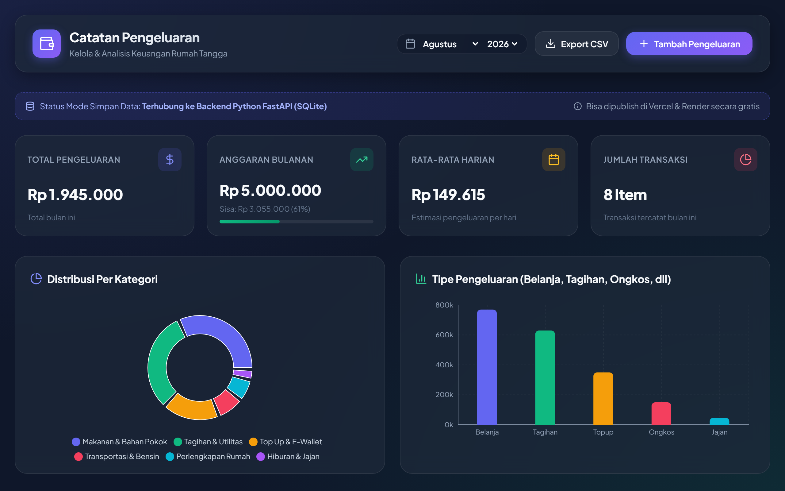
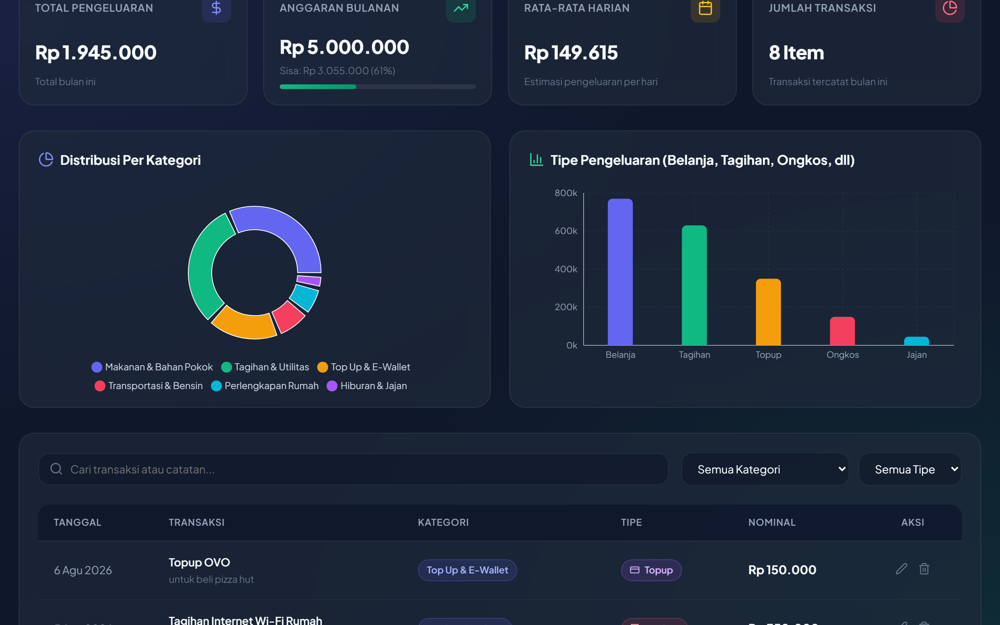
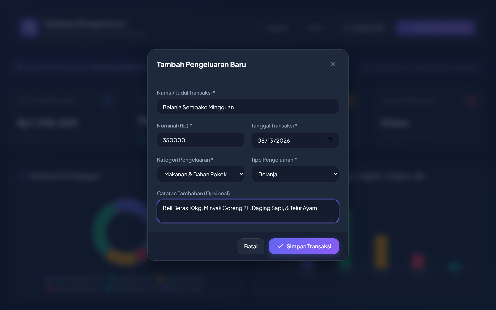
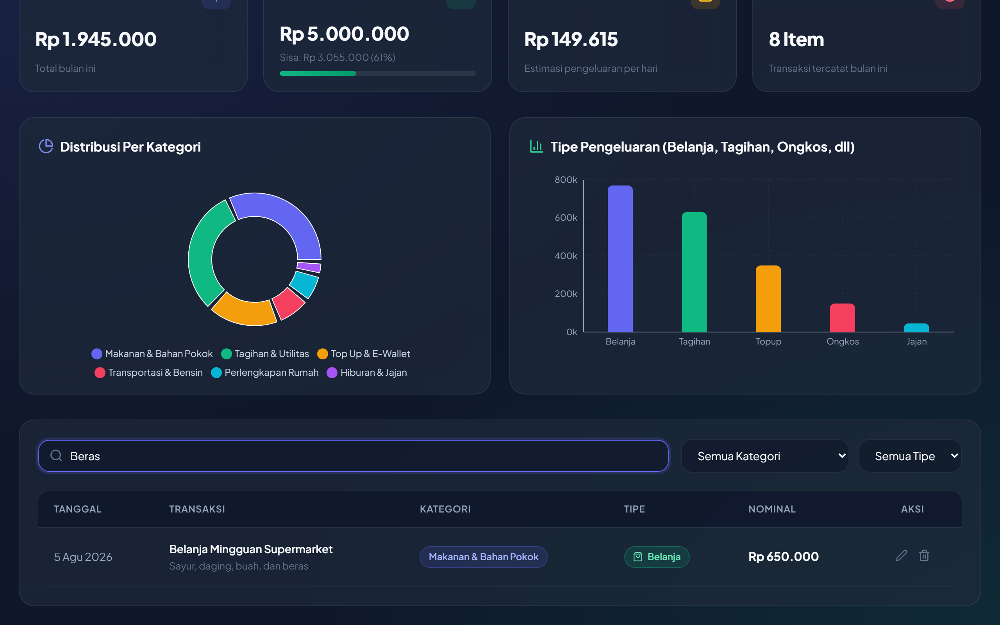
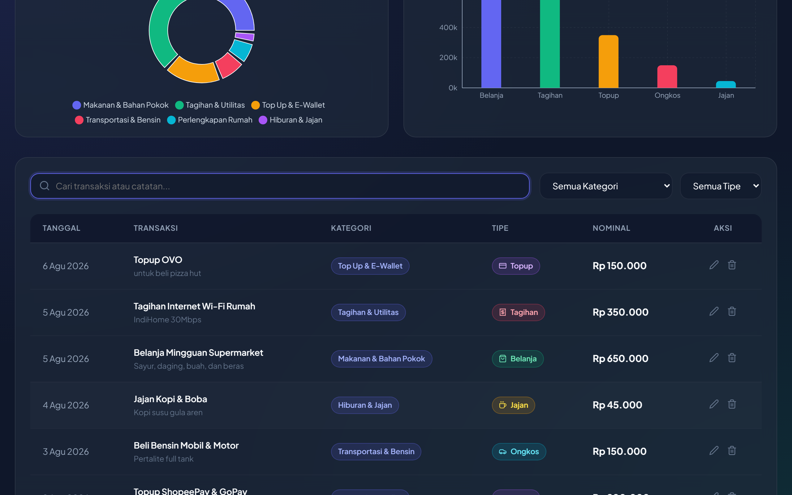
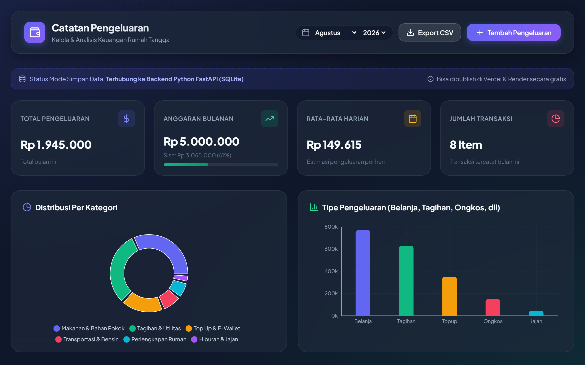

# 📖 User Manual
## Household Expense Tracker Web Application

**Application Version:** 1.0.0  
**Language:** English  
**Date:** August 2026  

---

## 📋 Table of Contents
1. [Introduction & Key Features](#1-introduction--key-features)
2. [Header Navigation & Storage Mode](#2-header-navigation--storage-mode)
3. [Reading Dashboard & KPI Summary Cards](#3-reading-dashboard--kpi-summary-cards)
4. [Visual Analytics & Charts](#4-visual-analytics--charts)
5. [Adding a New Expense Entry](#5-adding-a-new-expense-entry)
6. [Real-Time Search & Transaction Filtering](#6-real-time-search--transaction-filtering)
7. [Editing & Deleting Transactions](#7-editing--deleting-transactions)
8. [Exporting Monthly Reports to CSV](#8-exporting-monthly-reports-to-csv)
9. [Troubleshooting & Frequently Asked Questions (FAQ)](#9-troubleshooting--frequently-asked-questions-faq)

---

## 1. Introduction & Key Features

The **Household Expense Tracker** is a modern full-stack web application designed to help households seamlessly log, categorize, analyze monthly expenses, and track budget targets in real-time.

### ✨ Key Features:
* **Dual-Mode Storage**: Persistently saves to a Python FastAPI + SQLite backend database, with an automatic fallback to *Browser LocalStorage* when offline or in demo mode.
* **Monthly Budget Target Monitoring**: Visual budget progress bar with automatic warning alerts (*Green*, *Yellow*, *Red Alert* when exceeding budget).
* **Interactive Visual Analytics**: Category percentage distribution Donut Chart and Expense Type Bar Chart.
* **Smart Instant Search & Filter**: Filter transactions by keywords, specific categories, or expense types.
* **CSV Report Export**: Download monthly expense reports in `.CSV` format compatible with Microsoft Excel and Google Sheets.

---

## 2. Header Navigation & Storage Mode

At the top of the application page, you will find the main header navigation bar:

### Header Elements:
1. **Title & Icon**: Displays the application title "💸 Household Expense Tracker".
2. **Month & Year Selectors**: Use the dropdown menus to switch between different reporting periods.
3. **Storage Mode Status Indicator**:
   * 🟢 **FastAPI Server (SQLite)**: Connected to local Python backend. Data is saved permanently.
   * 🟡 **Demo Mode (LocalStorage)**: Backend server is offline; data is stored locally in your browser.
4. **Export CSV Button**: Downloads the current period's transactions to a `.CSV` file.
5. **+ Add Expense Button**: Opens the modal dialog form to log a new expense transaction.

---

## 3. Reading Dashboard & KPI Summary Cards

The dashboard features 4 primary Key Performance Indicator (KPI) cards that provide an instant snapshot of your finances:

### KPI Card Breakdown:
1. **Total Expenses This Month**:
   * Displays the cumulative sum of all logged expenses in Indonesian Rupiah (IDR) for the selected period.
2. **Monthly Budget Target & Remaining**:
   * Displays your monthly budget allocation (Default: IDR 5,000,000) and remaining unused balance.
   * Color Progress Bar:
     * 🟢 **Green (< 75%)**: Safe spending level.
     * 🟡 **Yellow (75% - 100%)**: Spending is approaching monthly budget limit.
     * 🔴 **Red (> 100%)**: Budget limit exceeded!
3. **Daily Average Estimate**:
   * Estimated average spending per day for the current month.
4. **Total Transactions**:
   * Total count of recorded expense items in the selected period.

---

## 4. Visual Analytics & Charts

The application provides two dynamic chart views powered by Recharts to analyze resource allocation:

1. **Donut Chart (Category Percentage)**:
   * Visualizes expense percentage breakdown across categories (*Groceries*, *Bills & Utilities*, *Transportation*, *Entertainment*, *Healthcare*, etc.).
   * Hover over chart segments to view exact amounts and percentage distributions.
2. **Bar Chart (Expense Type)**:
   * Compares total expenditure across expense types (*Shopping*, *Bills*, *Snacks*, *Transit*, *Topup*, *Others*).

---

## 5. Adding a New Expense Entry

To record a new expense, follow these simple steps:

### Step-by-Step Guide:
1. Click the green **`+ Add Expense`** button located at the top-right of the header bar.
2. The modal dialog will open. Complete the following fields:
   * **Transaction Name** *(Required)*: Enter the item description (e.g., `Weekly Groceries`).
   * **Amount (IDR)** *(Required)*: Enter numeric value without dots/commas (e.g., `350000`).
   * **Date** *(Required)*: Select transaction date.
   * **Category** *(Required)*: Select appropriate category from dropdown.
   * **Expense Type** *(Required)*: Select type (*Shopping*, *Bills*, *Snacks*, *Transit*, *Topup*, *Others*).
   * **Notes** *(Optional)*: Add optional details or items purchased.
3. Click the green **`Save Transaction`** button.
4. The new entry will instantly appear in the transaction table and update dashboard stats and charts.

---

## 6. Real-Time Search & Transaction Filtering

Quickly locate specific entries using the instant Search and Filter bar located above the transaction table:

* **Keyword Search Input**: Type any transaction name or note (e.g., `Groceries` or `Electricity`) for instant filtered results.
* **Category Filter Dropdown**: Filter table to show only items matching a chosen category (e.g., *Groceries & Staples*).
* **Type Filter Dropdown**: Filter table by expense type (e.g., *Bills*).

---

## 7. Editing & Deleting Transactions

Modify or delete existing records at any time using the **Actions** column in the transaction table:

* **Editing a Transaction**:
  1. Click the **Pencil (Edit)** icon on the target row.
  2. Modify transaction fields in the edit modal.
  3. Click **`Save Changes`**.
* **Deleting a Transaction**:
  1. Click the **Trash (Delete)** icon on the target row.
  2. Confirm deletion in the prompt dialog.

---

## 8. Exporting Monthly Reports to CSV

Generate offline spreadsheet-compatible reports in `.CSV` format:

### How to Export:
1. Select the desired **Month** and **Year** period from the header navigation.
2. Click the **`Export CSV`** button in the header bar.
3. A file named `Laporan_Pengeluaran_M_YYYY.csv` (e.g., `Laporan_Pengeluaran_8_2026.csv`) will be downloaded to your browser's Downloads folder.
4. Open the file in **Microsoft Excel**, **Google Sheets**, or any spreadsheet application.

---

## 9. Troubleshooting & Frequently Asked Questions (FAQ)

> [!TIP]
> **Common Questions & Answers:**
>
> 1. **Why does the status indicator display "Demo Mode (LocalStorage)"?**  
>    *This indicates the FastAPI backend server is not running. The web app automatically operates in client-side storage mode so you can continue using all features seamlessly.*
>
> 2. **Is my data safe in Demo Mode?**  
>    *Yes, your data is stored securely in your web browser's local storage. However, clearing browser cache may reset this offline data. Running the Python backend is recommended for persistent long-term storage.*
>
> 3. **Can I customize the monthly budget limit?**  
>    *The default monthly target is IDR 5,000,000, which can be customized in the application configuration settings.*
